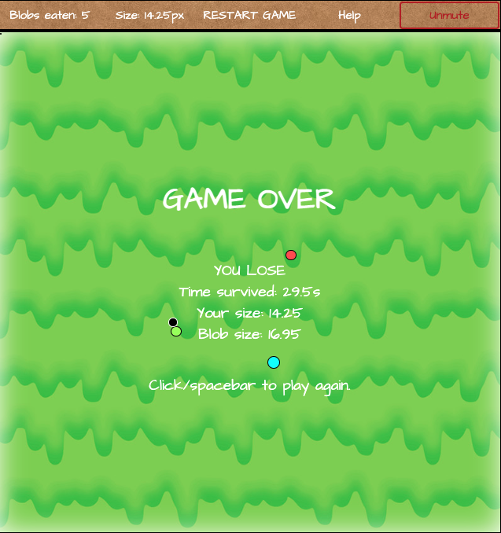

> Made by Camiel (2022).

# 

## Introduction

**Blobby** is a simple early 2000's Flash-style game of survival. You play as a small blob and must avoid all the big blobs around you while consuming the smaller ones to grow in size.

The game ends when:
- **(Win)** You grow to a size of 100px, or 
- **(Loss)** You are caught by a blob bigger than you.

> **PLAY THE GAME:** https://camielvs.github.io/Blobby/

## SETUP

There is no setup involved with Blobby and there are no game settings to customise. When you open the game you will be greeted with a simple window that describes the game and gives a random hint, like below.

To start the game, click the mouse in the game screen, or press SPACEBAR.

## HOW TO PLAY

### CONTROLS
Your blob can be moved by using the arrow keys or WASD on your keyboard. You are unable to move your blob outside of the game window.
You have access to a temporary speed boost which can be activated by pressing SPACEBAR. Once used, the speed boost cannot be used again for 12s.

The game can be paused at any time by clicking on the timer in the menubar or by pressing Q.

### GAME OPTIONS
Currently the menu bar across the top of the game screen has limited functionality.

- The two left-most options display some game statistics, but do not do anything when clicked.
- The game clock in the middle displays how much time has elapsed and will pause/unpause the game if clicked.
- The "help" button is currently functionless.
- The mute button on the right end will mute all audio including sound effects and the background music tracks.

## GAMEPLAY
When you unpause the game the timer and music will start and the introductary text will fade out. You will then be free to move your blob with your keyboard.

As time progresses, green blobs of various sizes will cross the game window. The size of these blobs scales with your own size. Additionally, your blob size will decay over time.

You are be able to move around to avoid or collide with these blobs and interact with them. If you collide with a blob that is smaller than you, you will become a little bit bigger.

Occasionally a special blob of a different colour will appear. These blobs have various unique abilities which are described further below.

As time progresses the spawn rate of blobs and special blobs will increase, making the game more hectic!

The game ends when you either reach 200px in size, or collide with a blob bigger than you.

When the game has ended, you will be able to restart by pressing SPACEBAR or by clicking on the game clock.

> Think you can beat my current best time of 92.37s? Give **Blobby** a go on [Github](https://camielvs.github.io/Blobby/)!

### BLOB TYPES
There are nine different types of blob that can appear in the game:

1. **Normal** (green): does nothing special.
2. **Angelic** (white): grants triple the normal size. Very rare.
3. **Speeder** (orange): small, but moves very fast.
4. **Grower** (teal): size increases over time.
5. **Jumbo** (grey): big, but very slow.
6. **Tracker** (red): relentlessly hunts the player until it releases it is too small.
7. **Hawk** (brown): broadly circles the player before striking.
8. **Meteor** (yellow): moves fast and is drawn in by the player's gravity. Will cause the player to shrink if consumed.
9. **Radioactive** (multi-coloured): follows the player closely and spawns glowing toxic particles as it goes. Will cause the player to shrink if consumed. Very rare.

## TECHNICAL DETAILS
This game was built using **HTML**, **CSS** and **JavaScript**. JSQuery was not used to build this game.

This game is not optimised for small screens. Sorry :(

The game can be played on Github: https://camielvs.github.io/Blobby/
and the source code can be found in the Github repository: https://github.com/camielvs/Blobby.git

> This game was built as part of General Assembly's Software Development Bootcamp.

## NEXT STEPS
There are a large number of possibilities to further the development of this game. A variety of ideas are given below:
- Highscores functionality.
- Help/bestairy/in-game logbook.
- More game statistics.
- Custom blob icons.
- UI scaling for larger/smaller devices.
- Proper overhang rendering for large blobs as they enter/exit the game board.
- Temporary powerups (speed boost/invincibility etc).
- Custom game modes that increase difficulty, e.g. hard mode/~~decay mode~~/mutation mode.
- More blob types to discover (e.g. ink, rainbow, toxic, heart).
- Refine AI and pathing for aggressive blobs.
- Ability for blobs to morph together and bounce when they collide.
- Animated effects when blobs move and interact.
- Custom music and more variety in background tracks.
- Refactor code for readability and enhanced functionality.
- Mouse control for player.
- Multiplayer blobwars.
